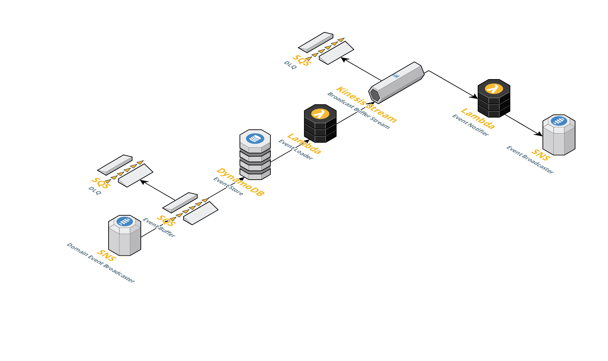

# typescript-serverless-example-1

This project will build a simple service that utilises the key pieces of serverless projects. It will provide examples on how to connect services using SNS, SQS, Lambda, DynamoDB, DynamoDB Streams and Kinesis.

There won't be any domain logic in this example, rather we will focus on the architecture and how to connect it all together. The complexity in serverless applications is pushed to the network boundary and it can be daunting for new comers to understand how to piece everything together. It is my aim to give some examples for people to copy that they can re-purpose.

For a full breakdown of what is happening you can read a full walkthrough of this repository [here](#)

